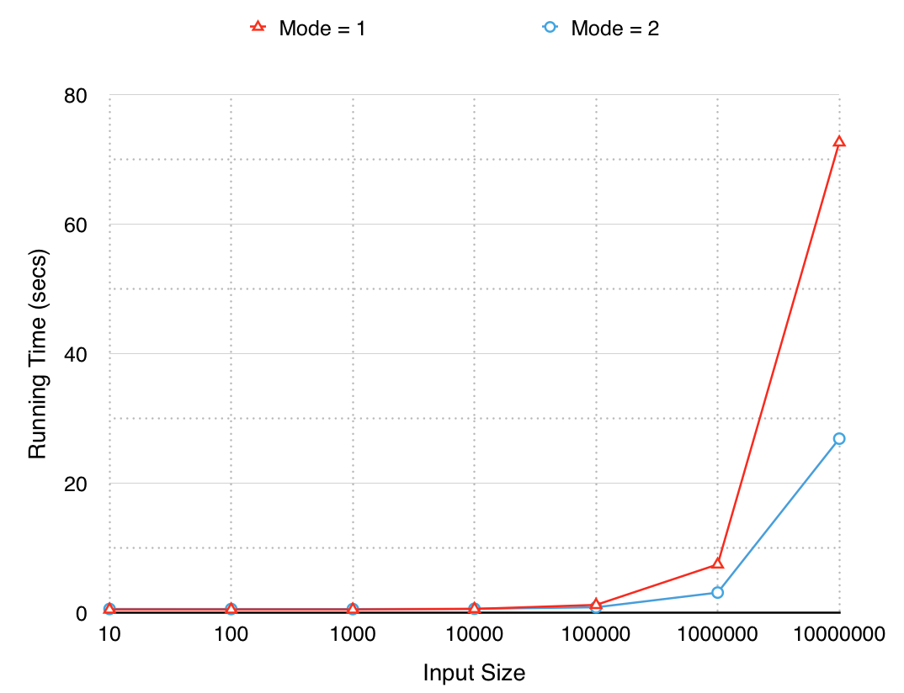

Reverse Geocoder
=================
A Python library for offline reverse geocoding. It improves on an existing library called [reverse_geocode](https://pypi.python.org/pypi/reverse_geocode/1.0) developed by [Richard Penman](https://bitbucket.org/richardpenman/reverse_geocode).

*UPDATE (11-Apr-15)*: v1.4 released! See release notes below.

### About
Ajay Thampi | [@thampiman](https://twitter.com/thampiman) | [opensignal.com](http://opensignal.com) | [ajaythampi.com](http://ajaythampi.com)

## Features
1. Besides city/town and country code, this library also returns the nearest latitude and longitude and also administrative regions 1 and 2.
2. This library also uses a parallelised implementation of K-D trees which promises an improved performance especially for large inputs.

The K-D tree is populated with cities that have a population > 1000. The source of the data is [GeoNames](http://download.geonames.org/export/dump/).

## Installation
For first time installation,
```
$ pip install reverse_geocoder
```

Or upgrade an existing installation using,
```
$ pip install --upgrade reverse_geocoder
```

Package can be found on [PyPI](https://pypi.python.org/pypi/reverse_geocoder/).

### Dependencies
1. scipy
2. numpy

### Release Notes
1. v1.0 (27-Mar-15) - First version with support for only Python2
2. v1.1 (28-Mar-15) - Fix for issue [#1](https://github.com/thampiman/reverse-geocoder/issues/1) by [Brandon](https://github.com/bdon)
3. v1.2 (30-Mar-15) - Support for Python 3, conversion of [Geodetic](http://en.wikipedia.org/wiki/Geodetic_datum) coordinates to [ECEF](http://en.wikipedia.org/wiki/ECEF) for use in K-D trees to find nearest neighbour using the Euclidean distance function. This release fixes issues [#2](https://github.com/thampiman/reverse-geocoder/issues/2) and [#8](https://github.com/thampiman/reverse-geocoder/issues/8). Special thanks to [David](https://github.com/DavidJFelix) for his help in partly fixing [#2](https://github.com/thampiman/reverse-geocoder/issues/2).
4. v1.3 (11-Apr-15) - This release fixes issues [#9](https://github.com/thampiman/reverse-geocoder/issues/9), [#10](https://github.com/thampiman/reverse-geocoder/issues/10), [#11](https://github.com/thampiman/reverse-geocoder/issues/11) and [#12](https://github.com/thampiman/reverse-geocoder/issues/12). License has been changed from MIT to LGPL (see [#12](https://github.com/thampiman/reverse-geocoder/issues/12)).
5. v1.4 (08-Jul-16) - Included numpy and scipy as dependencies in setup.  

## Usage
The library supports two modes:

1. Mode 1: Single-threaded K-D Tree (similar to [reverse_geocode](https://pypi.python.org/pypi/reverse_geocode/1.0))
2. Mode 2: Multi-threaded K-D Tree (default)

```python
import reverse_geocoder as rg

coordinates = (51.5214588,-0.1729636),(9.936033, 76.259952),(37.38605,-122.08385)

results = rg.search(coordinates) # default mode = 2

print results
```

The above code will output the following:
```
	[{'name': 'Bayswater', 
      'cc': 'GB', 
      'lat': '51.51116',
      'lon': '-0.18426', 
      'admin1': 'England', 
      'admin2': 'Greater London'}, 
     {'name': 'Cochin', 
      'cc': 'IN', 
      'lat': '9.93988',
      'lon': '76.26022', 
      'admin1': 'Kerala', 
      'admin2': 'Ernakulam'},
     {'name': 'Mountain View', 
      'cc': 'US', 
      'lat': '37.38605',
      'lon': '-122.08385', 
      'admin1': 'California', 
      'admin2': 'Santa Clara County'}]
```

If you'd like to use the single-threaded K-D tree, set mode = 1 as follows:
```python
results = rg.search(coordinates,mode=1)
```

## Performance
The performance of modes 1 and 2 are plotted below for various input sizes.



Mode 2 runs ~2x faster for very large inputs (10M coordinates).

## Acknowledgements
1. Major inspiration is from Richard Penman's [reverse_geocode](https://bitbucket.org/richardpenman/reverse_geocode) library 
2. Parallelised implementation of K-D Trees is extended from this [article](http://folk.uio.no/sturlamo/python/multiprocessing-tutorial.pdf) by [Sturla Molden](https://github.com/sturlamolden)
3. Geocoded data is from [GeoNames](http://download.geonames.org/export/dump/)

## License
Copyright (c) 2015 Ajay Thampi and contributors. This code is licensed under the LGPL License.